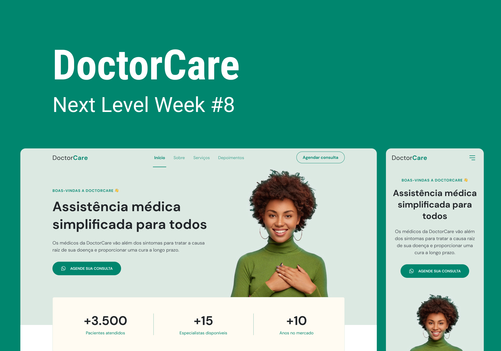

align="center">
  <a href="#-tecnologias">Технология</a>&nbsp;&nbsp;&nbsp;|&nbsp;&nbsp;&nbsp;
  <a href="#-projeto">Проект</a>&nbsp;&nbsp;&nbsp;|&nbsp;&nbsp;&nbsp;
  <a href="#-layout">Layout</a>&nbsp;&nbsp;&nbsp;|&nbsp;&nbsp;&nbsp;
  <a href="#">Licença</a>

 

  

 

  

## 🚀 Технологии

Этот проект был разработан с использованием следующих технологий:

- HTML
- CSS
- JavaScript
- [ScrollReveal](https://scrollrevealjs.org/)

## 💻 Проект

DoctorCare-это институциональная страница в формате One Page, адаптивная для использования в различных типах микро, малых и средних предприятий. Содержит следующие разделы: Header, Navigation, Home, About, Services и Footer
## 🔖 Layout

Você pode visualizar o layout do projeto através [desse link]([https://www.figma.com/community/file/1102912263666619803](https://www.figma.com/file/lWcGOYImBgbrUBBGQAM7RH/DoctorCare-(Community)-(Copy)?type=design&node-id=0-1&mode=design&t=RjhHXOEgiCMC7e2L-0)). É necessário ter conta no [Figma](https://figma.com) para acessá-lo.

## 📝 Licença

.

---

Feito com 💜 by Paulino Zage

<!--START_SECTION:footer-->

 
 

  

<!--END_SECTION:footer-->
